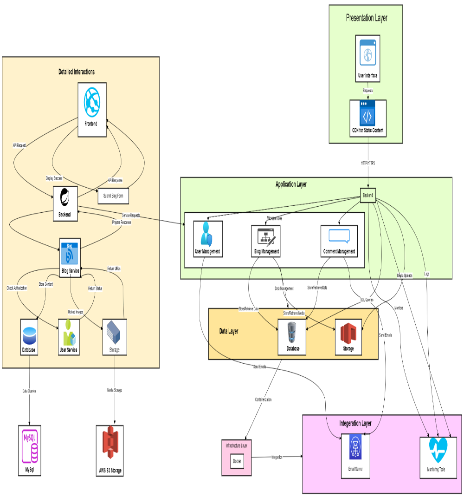

# MetaBlog

MetaBlog is a simple yet elegant blogging platform focused on tech-related blogs. Users can create, view, and save blogs to their saved list for later reference. The platform supports user and admin roles, with users managing their profiles and blogs, while admins oversee the entire platform. The application follows clean code practices, design patterns, and TDD (Test-Driven Development) principles.

## Features

- **User Registration and Authentication**: Users can sign up, log in, and reset their passwords.
- **Blogs Listing**: Users can view all the approved blogs on the platform.
- **User Profile Management**: Users can manage their profile details, including social media links.
- **Blog Management**: Users can create, view, and save other blogs. Admins can manage all blogs on the platform.
- **Role-Based Access Control**: Separate functionalities for users and admins.
- **Responsive Design**: The front end is designed to be responsive and user-friendly.
- **Alerts and Notifications**: SweetAlert2 is used for displaying alerts and validation messages.
- **Image Upload**: Images are stored using AWS S3 bucket.
- **TDD and Best Practices**: The project follows TDD and clean code practices.

## Tools and Technologies

### Frontend

- **React**: A JavaScript library for building user interfaces.
- **React Hooks**: For state management.
- **React Router**: For routing.
- **Axios**: For making HTTP requests.
- **Tailwind CSS**: For styling components.
- **SweetAlert2**: For alerts and notifications.
- **FontAwesome**: For icons.
- **Heroicons**: For icons.
- **React Dropzone**: For image uploads.
- **TinyMCE**: For rich text editing.
- **Radix UI**: For avatar components.

### Backend

- **Spring Boot**: A Java-based framework used to create microservices.
- **Spring Security**: For authentication and authorization.
- **Spring Data JPA**: For data persistence.
- **JWT**: For token-based authentication.
- **Lombok**: To reduce boilerplate code.
- **AWS S3**: For image storage.
- **MySQL**: For database management.
- **JUnit 5 & Mockito**: For testing.
- **Thymeleaf**: For email templates.
- **Swagger**: For API documentation.

## Project Structure

### Backend Modules Overview

- **Admin**: Handles admin-specific functionalities.
- **Authentication**: Manages user authentication and authorization.
- **Blog**: Contains business logic for blog operations.
- **Comment**: Manages comments on blogs.
- **Config**: Application configuration files.
- **Email**: Handles email services.
- **Enum**: Contains enumeration types.
- **Exception**: Custom exception handling.
- **Image**: Manages image uploads and storage.
- **Jwt**: Handles JWT token creation and validation.
- **OTP**: Manages One-Time Passwords.
- **User**: Handles user-related functionalities.
- **Utils**: Utility classes and methods.

### Frontend Overview

- **Components**: Reusable UI components.
- **Pages**: Different pages of the application, like login, signup, profile, etc.
- **Styles**: Global and component-specific styles.

### Architecture Diagram


## Cloning and Running the Project Locally

### Prerequisites

- **Node.js** (for the frontend)
- **Java 11** or higher (for the backend)
- **Maven** (for the backend)
- **MySQL** (for the database)
- **AWS Account** (for S3 bucket)


### Frontend

1. Clone the repository:

   ```bash
   git clone https://git.cs.dal.ca/courses/2024-summer/csci-5308/group03.git
   ```

2. Navigate to the frontend directory:

   ```bash
   cd metablog-frontend
   ```

3. Install the dependencies:

   ```bash
   npm install
   ```

4. Start the development server:

   ```bash
   npm start
   ```

   The frontend should be running on `http://localhost:3000`.

### Backend

1. Navigate to the backend directory:

   ```bash
   cd metablog-backend
   ```

2. Configure the MySQL database:

    - Create a database named `metablog`.
    - Update the `application.properties` file with your MySQL database credentials:

      ```properties
      spring.datasource.url=jdbc:mysql://localhost:3306/metablog
      spring.datasource.username=your_username
      spring.datasource.password=your_password
      spring.jpa.hibernate.ddl-auto=update
      ```

3. Build the project using Maven:

   ```bash
   mvn clean install
   ```

4. Run the application:

   ```bash
   mvn spring-boot:run
   ```

   The backend should be running on `http://localhost:8080`.

### Configuration

- **AWS S3**: Configure your AWS credentials and S3 bucket details in the `application.properties` file.
- **Environment Variables**: Set up necessary environment variables for the application.

## Libraries and Dependencies

### Backend

- `Spring Boot`
- `Spring Security`
- `Spring Data JPA`
- `JWT`
- `Lombok`
- `AWS SDK`
- `MySQL Connector Java`

---

This project is part of the CSCI 5308 Advanced Software Development Concepts course, supervised by Professor Shuntian Yang.

Happy Blogging!